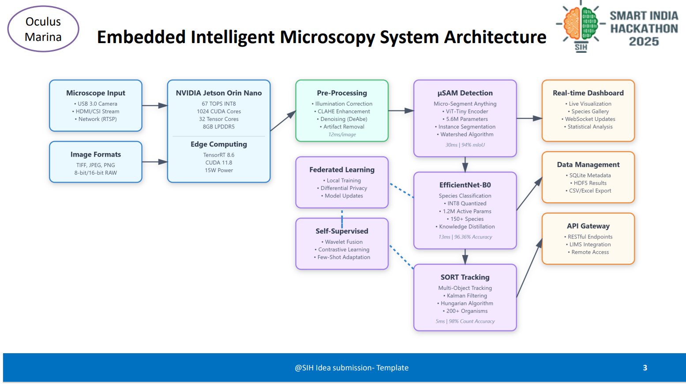

# OCULUS MARINE Embedded Intelligent Microscopy System (Oculus Marina)

(3.png)

[](https://www.sih.gov.in/)


## Overview

The OCULUS MARINE Embedded Intelligent Microscopy System (codenamed Oculus Marina) is a revolutionary AI-powered add-on module designed to automate the identification and counting of marine organisms under standard microscopes. Developed as part of the Smart India Hackathon 2025 (Problem Statement ID: 25043, Theme: Smart Automation, Category: Software/Hardware), this system transforms any existing microscope into an intelligent tool for marine biodiversity assessment.

Key highlights:
- **Accuracy**: 96.36% species-level accuracy (top-1), 99.2% top-5.
- **Speed**: 100ms per image processing time, handling up to 850 organisms/min.
- **Cost**: Under ₹35,000 total system cost.
- **Platform**: Edge AI on NVIDIA Jetson Orin Nano Super for real-time, on-device processing.
- **Team**: OculusMarina (Team ID: 33).

By integrating multi-stage AI pipelines with edge computing, the system eliminates the need for manual examination, reducing analysis time from 6+ hours per sample batch to minutes while minimizing human error (30-40% in manual methods).

## Problem Statement

Manual microscopic analysis of marine organisms faces significant challenges:
- Requires 6+ hours of manual examination per sample batch.
- Demands PhD-level taxonomic expertise for accurate identification.
- High error rates (30-40%) due to human fatigue.
- Subjective and inconsistent results between operators.
- Lacks real-time data processing capabilities.

This bottlenecks marine research, environmental monitoring, and harmful algal bloom detection, impacting citizen science and policy decisions.

## Solution Architecture

The system is an embedded AI module that plugs into existing microscopes via standard interfaces (C-mount/eyepiece). It features:
1. **Direct Microscope Integration**: USB 3.0, HDMI/CSI, or network stream inputs.
2. **Edge AI Processing**: Powered by NVIDIA Jetson Orin Nano Super.
3. **Three-Stage AI Pipeline**: Detection → Classification → Counting.
4. **Real-Time Processing**: Automated reporting and dashboard.
5. **Federated Learning**: For continuous model improvement without cloud dependency.

### High-Level System Flow
- **Input**: Microscope images (JPEG, PNG, TIFF, BMP; up to 4K resolution).
- **Pre-Processing**: Illumination correction, contrast enhancement, denoising.
- **Detection**: μSAM (Micro-Segment Anything Model) for organism segmentation.
- **Classification**: Optimized EfficientNet-B0 for species identification (150+ marine species).
- **Tracking & Counting**: Enhanced SORT with Kalman filtering.
- **Output**: Real-time dashboard, CSV/Excel exports, statistical analysis.




## Hardware Architecture

### Computing Platform
- **Primary**: NVIDIA Jetson Orin Nano Super
  - AI Performance: 67 TOPS (INT8).
  - GPU: 1024-core NVIDIA Ampere with 32 Tensor Cores.
  - CPU: 6-core ARM Cortex-A78AE.
  - Memory: 8GB 128-bit LPDDR5 (102.4 GB/s).
  - Power: 7W-25W configurable.
  - Cost: ₹20,000.
- **Alternative Low-Power Option**: Intel Hailo-8L + Raspberry Pi 5
  - 13 TOPS at 2.5W.
  - Total Cost: ₹12,000.
  - Trade-off: 5x lower performance.

### Image Input Interface
- USB 3.0 Camera: Direct connection, supports 4K@60fps.
- HDMI/CSI: For microscopes with video output, zero-latency.
- Network Stream: Gigabit Ethernet, RTSP/HTTP support for multiple microscopes.

### Storage & Connectivity
- 256GB NVMe SSD for local storage and model cache.
- WiFi 6E + Bluetooth 5.2.
- Gigabit Ethernet.
- USB 3.0 ports for peripherals.

### Enclosure Design
- Dimensions: 150mm × 100mm × 50mm (compact).
- Mounting: VESA-compatible.
- Cooling: Passive heatsink with optional fan.
- Material: Aluminum alloy.
- Cost: ₹2,000.
- Power: 12-19V DC input, 15W typical (25W peak), optional UPS (2-hour battery backup).

## AI Pipeline Architecture

### 3.1 Image Pre-Processing Module
Handles input images with algorithms for microscope-specific corrections.

**Example Code Snippet (Python)**:
```python
class MicroscopeImageProcessor:
    def __init__(self):
        self.supported_formats = ['.jpg', '.png', '.tiff', '.bmp']
        self.target_resolution = (1024, 1024)

    def process_image(self, image_path):
        # Load microscope image
        image = cv2.imread(image_path, cv2.IMREAD_UNCHANGED)
        
        # Handle different bit depths (8-bit, 16-bit)
        if image.dtype == np.uint16:
            image = (image / 256).astype(np.uint8)
        
        # Apply preprocessing pipeline
        image = self.correct_illumination(image)
        image = self.enhance_contrast(image)
        image = self.denoise(image)
        
        return image
